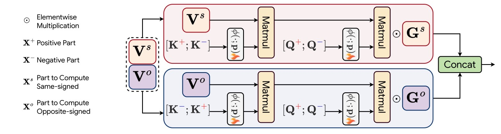
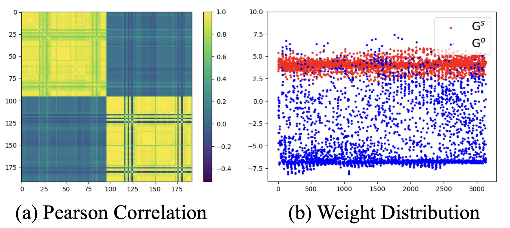
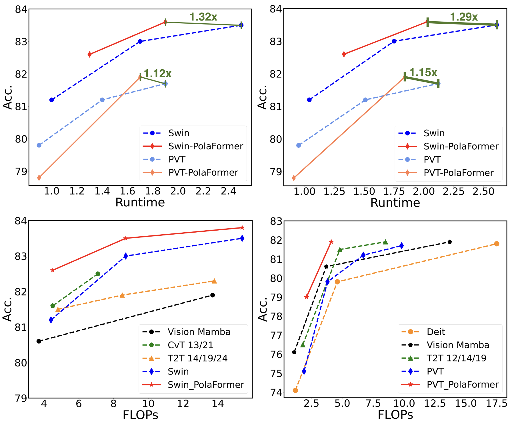

# PolaFormer: Polarity-aware Linear Attention for Vision Transformers
<h5 align="center">

This repo contains the official **PyTorch** code and pre-trained models for PolaFormer (ICLR 2025). 

[](https://arxiv.org/abs/2501.15061)
[](https://huggingface.co/ZachMeng/PolaFormer/tree/main)
[](https://hits.seeyoufarm.com)
</h5>

## Introduction

### Motivation

Linear attention has emerged as a promising alternative to softmax-based attention, leveraging kernelized feature maps to reduce complexity from $\mathcal{O}(N^2)$ to $\mathcal{O}(N)$ in sequence length. However, the non-negative constraint on feature maps and the relaxed exponential function used in approximation lead to significant information loss compared to the original query-key dot products, resulting in less discriminative attention maps with higher entropy.
 To address the missing interactions driven by negative values in query-key pairs and the high entropy, we propose the **PolaFormer**, which achieves a superior balance between expressive capability and efficiency.

### Method

 In this paper,  we propose the polarity-aware linear attention mechanism that explicitly models both same-signed and opposite-signed query-key interactions, ensuring comprehensive coverage of relational information. Furthermore, to restore the spiky properties of attention maps, we prove that the existence of a class of element-wise functions (with positive first and second derivatives) can reduce entropy in the attention distribution. Finally, we employ a learnable power function for rescaling, allowing strong and weak attention signals to be effectively separated. 
 <p align="center">
    
</p>
 Notably, we introduce two learnable polarity-aware coefficients matrices applied with element-wise multiplication, which are expected to learn the complementary relationship between same-signed and opposite-signed values.  
<p align="center">
    
</p>

### Results

- Comparison of different models on ImageNet-1K.

<p align="center">
    
</p>

- Performance on Long Range Arena benchmark.

| Model                 | Text  | ListOps | Retrieval      | Pathfinder | Image | Average |
|-----------------------|-------|---------|----------------|------------|-------|---------|
| $\text{PolaFormer}_{\alpha=3}$ | 73.06 | 37.35   | 80.50          | 70.53      | 42.15 | 60.72   |
| $\text{PolaFormer}_{\alpha=5}$ | 72.33 | 38.76   | 80.37          | 68.98      | 41.91 | 60.47   |
| $\text{PolaFormer}_{\alpha=7}$ | 71.93 | 37.60   | 81.47          | 69.09      | 42.77 | 60.57   |


## Dependencies

- Python 3.9
- PyTorch == 1.11.0
- torchvision == 0.12.0
- numpy
- timm == 0.4.12
- einops
- yacs

## Data preparation

The ImageNet dataset should be prepared as follows:

```
$ tree data
imagenet
├── train
│   ├── class1
│   │   ├── img1.jpeg
│   │   ├── img2.jpeg
│   │   └── ...
│   ├── class2
│   │   ├── img3.jpeg
│   │   └── ...
│   └── ...
└── val
    ├── class1
    │   ├── img4.jpeg
    │   ├── img5.jpeg
    │   └── ...
    ├── class2
    │   ├── img6.jpeg
    │   └── ...
    └── ...
```

## Pretrained Models

Based on different model architectures, we provide several pretrained models, as listed below.

| model  | Reso | acc@1 | config |
| :---: | :---: | :---: | :---: |
| Pola-PVT-T | $224^2$ | 78.8 (+3.7) | [config](cfgs/pola_pvt_t.yaml) |
| Pola-PVT-S | $224^2$ | 81.9 (+2.1) | [config](cfgs/pola_pvt_s.yaml) |
| Pola-Swin-T | $224^2$ | 82.6 (+1.4) | [config](cfgs/pola_swin_t.yaml) |
| Pola-Swin-S | $224^2$ | 83.6 (+0.6) | [config](cfgs/pola_swin_s.yaml) |
| Pola-Swin-B | $224^2$ | 83.8 (+0.3) | [config](cfgs/pola_swin_b.yaml) |


Evaluate one model on ImageNet:

```shell
python -m torch.distributed.launch --nproc_per_node=8 main.py --cfg <path-to-config-file> --data-path <imagenet-path> --output <output-path> --eval --resume <path-to-pretrained-weights>
```

## Train Models from Scratch

- **To train our model on ImageNet from scratch, see pretrain.sh and run:**

```shell
bash pretrain.sh
```

## Acknowledgements

This code is developed on the top of [Swin Transformer](https://github.com/microsoft/Swin-Transformer) and [FLatten Transformer](https://github.com/LeapLabTHU/FLatten-Transformer).
## Citation

If you find this repo helpful, please consider citing us.

```latex
@misc{meng2025polaformerpolarityawarelinearattention,
      title={PolaFormer: Polarity-aware Linear Attention for Vision Transformers}, 
      author={Weikang Meng and Yadan Luo and Xin Li and Dongmei Jiang and Zheng Zhang},
      year={2025},
      eprint={2501.15061},
      archivePrefix={arXiv},
      primaryClass={cs.CV},
      url={https://arxiv.org/abs/2501.15061}, 
}
```

## Contact

If you have any questions, please feel free to contact the authors. 

Weikang Meng: [zacharymengwk@gmail.com](mailto:zacharymengwk@gmail.com)
